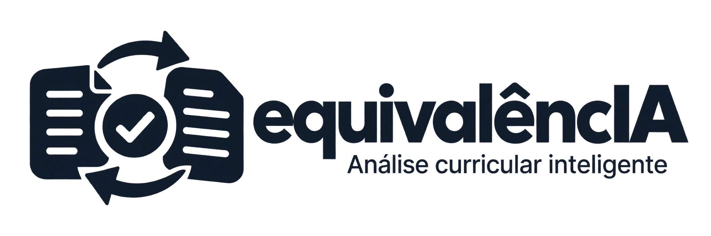

<p align="center">
  <picture>
    <source media="(prefers-color-scheme: dark)" srcset="assets/logo_dark.png">
    <source media="(prefers-color-scheme: light)" srcset="assets/logo_light.png">
    
  </picture>
</p>

<p align="center">
  <strong>Sistema de apoio à análise curricular e ao aproveitamento de disciplinas.</strong>
</p>

<p align="center">
  <a href="https://equivalencia.streamlit.app">
    
  </a>
</p>

<p align="center">
  
  
  
  
  
</p>

---

## Sobre o projeto

O **equivalencIA** é um sistema desenvolvido para auxiliar o processo de análise de equivalência e aproveitamento de disciplinas.

A aplicação organiza as informações do aluno e da análise curricular em um fluxo guiado, preparando os dados necessários para as etapas de comparação de disciplinas e apoio à decisão do coordenador.

O projeto está sendo desenvolvido como parte da disciplina de **Laboratório de Software da UNIPAR**.

## Aplicação online

A aplicação está publicada no **Streamlit Community Cloud** e utiliza um banco PostgreSQL remoto hospedado no **Supabase**.

**Acesse:** [equivalencia.streamlit.app](https://equivalencia.streamlit.app)

### Arquitetura atual

```text
Usuário / QA
     │
     ▼
Streamlit Community Cloud
     │
     ▼
   equivalencIA
     │
     ▼
Supabase PostgreSQL
```

O mesmo banco remoto também pode ser utilizado durante o desenvolvimento local.

## Funcionalidades atuais

Atualmente, o sistema permite:

- cadastrar alunos;
- buscar alunos por nome;
- editar dados de alunos;
- criar múltiplas análises para o mesmo aluno;
- retomar análises existentes;
- informar o semestre/ano de ingresso;
- registrar dados do curso e da instituição de origem;
- selecionar curso e matriz curricular de destino;
- navegar entre as etapas por meio de um fluxo guiado;
- validar pré-requisitos antes do avanço entre etapas;
- persistir dados em PostgreSQL;
- utilizar o sistema localmente ou pela versão publicada.

### Fluxo atual

```text
Aluno e Análise
      │
      ▼
Origem do Aproveitamento
      │
      ▼
Curso e Matriz
      │
      ▼
Próximas etapas
```

As funcionalidades de upload de documentos, extração de disciplinas, comparação com IA e geração do documento final ainda estão em desenvolvimento.

## Tecnologias

| Categoria | Tecnologias |
|---|---|
| Aplicação | Python, Streamlit |
| Banco de dados | PostgreSQL, Supabase |
| Acesso ao banco | psycopg |
| Configuração local | python-dotenv |
| Documentos | python-docx |
| Infraestrutura | GitHub, Streamlit Community Cloud, Supabase |

## Estrutura do projeto

```text
equivalencIA/
├── assets/             # identidade visual
├── documents/          # documentos e recursos do projeto
├── pages/              # páginas da aplicação
├── services/           # serviços da aplicação
├── sql/
│   ├── migrations/     # migrações incrementais
│   ├── schema.sql      # estrutura atual do banco
│   └── seed.sql        # dados iniciais
├── tests/              # testes automatizados
├── app.py              # entrada da aplicação Streamlit
├── database.py         # acesso e operações no PostgreSQL
├── navegacao.py        # controle do fluxo de análise
├── requirements.txt
└── README.md
```

## Banco de dados

O banco principal compartilhado do projeto utiliza PostgreSQL no **Supabase**.

O arquivo `sql/schema.sql` representa a estrutura completa necessária para criar uma base nova.

Para uma nova base:

```text
schema.sql
    │
    ▼
seed.sql
```

As migrações existentes em `sql/migrations/` são destinadas apenas a bancos criados em versões anteriores do projeto.

> **Importante:** não execute migrações antigas em um banco novo criado diretamente a partir do `schema.sql` atual.

## Executando localmente

### 1. Clone o repositório

```bash
git clone https://github.com/matheusheberle/equivalencIA.git
cd equivalencIA
```

### 2. Crie o ambiente virtual

#### Windows

```powershell
py -m venv .venv
.\.venv\Scripts\Activate.ps1
```

#### Linux/macOS

```bash
python3 -m venv .venv
source .venv/bin/activate
```

### 3. Instale as dependências

```bash
pip install -r requirements.txt
```

## Configuração do ambiente

Crie um arquivo `.env` na raiz do projeto:

```env
DB_HOST=
DB_PORT=5432
DB_NAME=
DB_USER=
DB_PASSWORD=
```

As credenciais do ambiente compartilhado são fornecidas pelo Supabase.

> Nunca envie o arquivo `.env`, senhas ou outras credenciais para o GitHub.

O `.env.example` deve conter somente os nomes das variáveis necessárias, sem valores privados.

## Executar a aplicação

Com o ambiente configurado:

```bash
python -m streamlit run app.py
```

A aplicação será disponibilizada no navegador.

## Streamlit Community Cloud

A versão online é publicada diretamente a partir do repositório GitHub.

As credenciais necessárias para acessar o Supabase são configuradas nos **Secrets do Streamlit Community Cloud** e não ficam armazenadas no código-fonte.

**Aplicação:** [https://equivalencia.streamlit.app](https://equivalencia.streamlit.app)

## Testes

Execute a suíte automatizada com:

```bash
python -m unittest discover -s tests -v
```

Os testes abrangem, entre outros cenários:

- cadastro e edição de alunos;
- RA opcional;
- busca por nome;
- múltiplas análises por aluno;
- validação do semestre/ano de ingresso;
- navegação entre etapas;
- pré-requisitos do fluxo;
- persistência das informações;
- tratamento de falhas do PostgreSQL;
- prevenção de confirmações falsas de salvamento.

Os testes de integração com PostgreSQL utilizam ambientes isolados e rollback para evitar alterações permanentes nos dados utilizados pela aplicação.

## Regras atuais importantes

- O nome do aluno é obrigatório.
- O RA é opcional.
- Um aluno pode possuir várias análises.
- O Semestre/Ano de ingresso é opcional.
- Quando informado, o ingresso deve utilizar o formato `1/2027` ou `2/2027`.
- Curso de origem e procedência são opcionais no fluxo atual.
- A situação do curso de origem deve ser:
  - `Concluído`
  - `Incompleto`
  - `Trancado`
- A matriz curricular representa uma versão da grade do curso.
- O período de encaixe do aluno será definido posteriormente no processo de análise.

## Roadmap

O backlog do projeto prevê:

- [ ] cadastro das disciplinas das matrizes da UNIPAR;
- [ ] planos de ensino das disciplinas de destino;
- [ ] upload do histórico acadêmico;
- [ ] upload opcional dos planos de ensino de origem;
- [ ] extração das disciplinas do histórico;
- [ ] revisão dos dados extraídos;
- [ ] validação de aprovação e carga horária;
- [ ] comparação de conteúdo com apoio de IA;
- [ ] sugestão de equivalências;
- [ ] decisão final do coordenador;
- [ ] geração do documento institucional.

> A IA terá papel de **apoio à análise**. A decisão final de equivalência continuará sendo realizada pelo coordenador.

## Equipe

| Integrante | Papel |
|---|---|
| **Matheus Heberle** | Product Owner / Scrum Master |
| **Anderson Damazio** | Desenvolvimento |
| **Thiago** | Desenvolvimento / IA |
| **Matheus Pavlak** | Quality Assurance |

## Status do projeto

🚧 **Em desenvolvimento**

O fluxo inicial de análise curricular já está funcional. Novas funcionalidades estão sendo implementadas de forma incremental por meio das Sprints.
